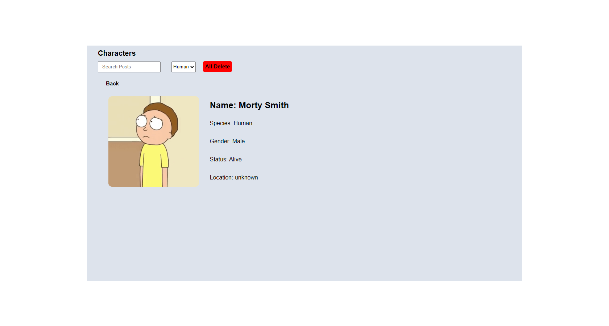

# GITHUB INDICATORS

# The-Rick-and-Morty-characters-Table

Hello, I create with React, RestAPI, and Axios Rick and Morty characters table. 

## ## RULES OF USE

> **STEP-1:** `https://github.com/cavidsuleyman/Dictionary-App-SvelteJS.git`  
> **STEP-2:**  enter the `The-Rick-and-Morty-characters-Table` folder that appears  
> **STEP-3:**  open the folder you are in in a text editor  
> **STEP-4:**  run all the files in the main folder "npm start"  
> **STEP-5:**  to download the project as `.zip`  [here](https://github.com/cavidsuleyman/Dictionary-App-SvelteJS/archive/refs/heads/master.zip) click  

## Technology

This project was developed using the following technologies

| No | Technique | Purpose |
| - | ---------- | --------------------- |
| 1 | React | Building a single-page application |
| 2 | RestAPI |  Fetch Data |
| 3 | Axios |  Get, search, and delete data |
| 4 | VSCode | Text editor used in the project |

## SAMPLE SCREEN APPEARANCE

 
